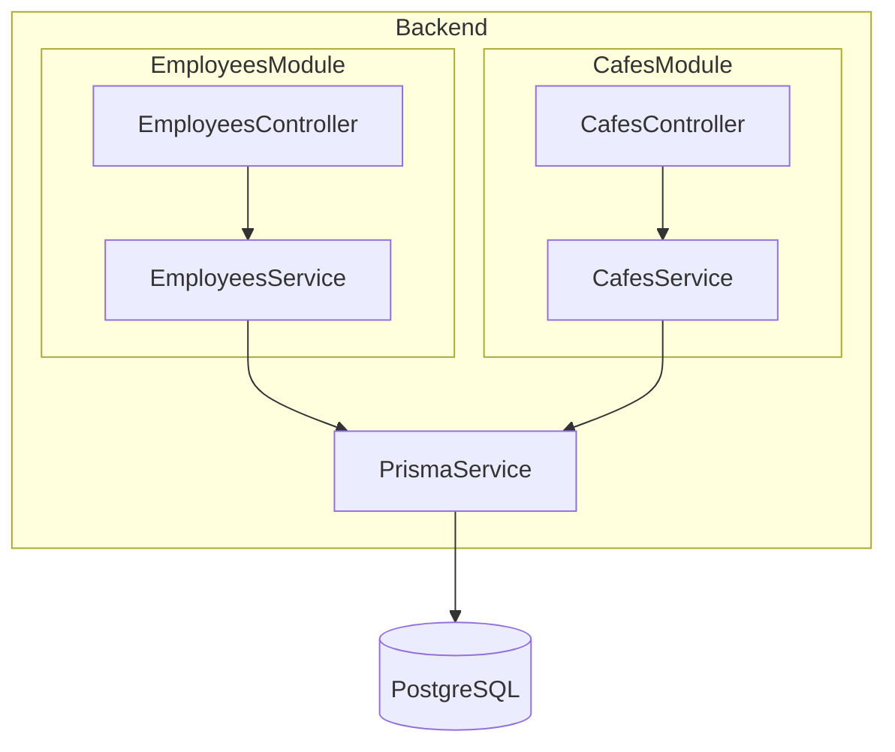
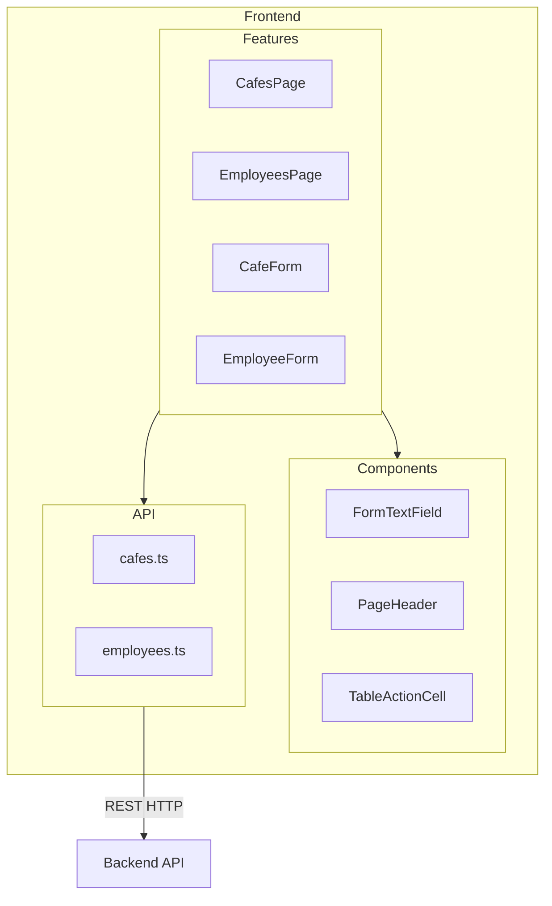

# Café Employee Manager

Full-stack implementing a café and employee manager with NestJS, PostgreSQL, and a React frontend.

## Links

- Live App: https://cafe-manager-gic-frontend.onrender.com
- Deployed Backend: https://cafe-manager-gic-backend.onrender.com

## Tech Stack

- Frontend: React (Vite), Ant Design, AG Grid, TanStack Query, React Router, Day.js, TypeScript
- Backend: NestJS (Node 22), Prisma ORM, PostgreSQL

## Running locally 

### Method 1: Docker Compose (recommended)

Prerequisites: Docker and Docker Compose installed.

```bash
docker compose up -d --build
```

Services:
- Frontend: http://localhost:5173
- Backend: http://localhost:3000
- Postgres: localhost:5432

Data is seeded automatically by Prisma on first run.

### Method 2: Individually

Frontend
```bash
nvm use 22
cd frontend
cp .env.example .env    # for vite base url
npm install
npm run dev
```

Backend
```bash
nvm use 22
cd backend
npm install
npm run prisma:generate && npm run prisma:migrate # if needed
npm run start:dev
```

Postgres
```
docker compose up -d postgres
```

## Project Structure

### Backend (NestJS + Prisma)

<table>
<tr>
<td width="40%">

**Folder Structure**

```
backend/
├── src/
│   ├── cafes/
│   │   ├── cafes.controller.ts
│   │   ├── cafes.service.ts
│   │   └── dto/
│   ├── employees/
│   │   ├── employees.controller.ts
│   │   ├── employees.service.ts
│   │   └── dto/
│   └── prisma/
│       ├── prisma.service.ts
│       └── prisma.module.ts
└── prisma/
    ├── schema.prisma
    └── migrations/
```

</td>
<td width="60%">

**Architecture**



</td>
</tr>
</table>

### Frontend (React + Vite)

<table>
<tr>
<td width="40%">

**Folder Structure**

```
frontend/
└── src/
    ├── api/
    │   # API client
    ├── features/
    │   # Main pages
    ├── components/
    │   # Reusable UI
    └── hooks/
        # Custom hooks
```

</td>
<td width="60%">

**Architecture**



</td>
</tr>
</table>

## APIs

- GET `/cafes?location=<string>` → list cafes with employee counts, sorted by employee count desc
- GET `/cafes/:id` → get a cafe
- POST `/cafes` → create cafe
- PUT `/cafes/:id` → update cafe
- DELETE `/cafes/:id` → delete cafe and all its employees

- GET `/employees?cafe=<string>` → list employees (optional filtering with cafe name), sorted by days worked desc
- GET `/employees/:id` → employee details
- POST `/employees` → create employee
- PUT `/employees/:id` → update employee
- DELETE `/employees/:id` → delete employee


